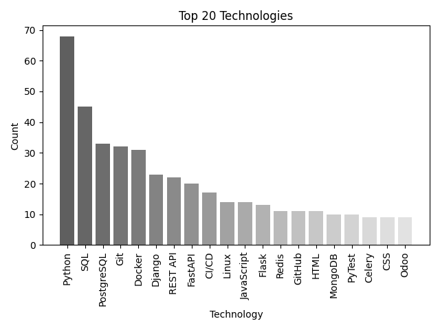
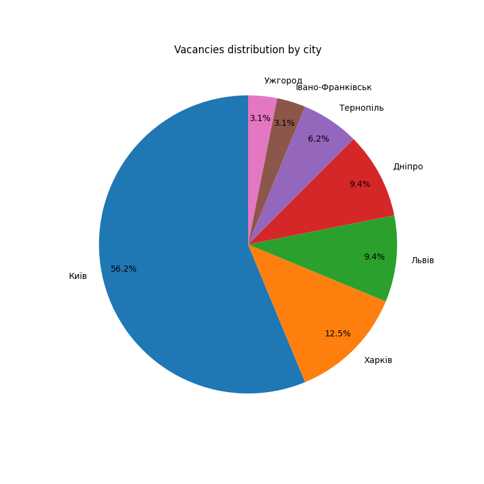
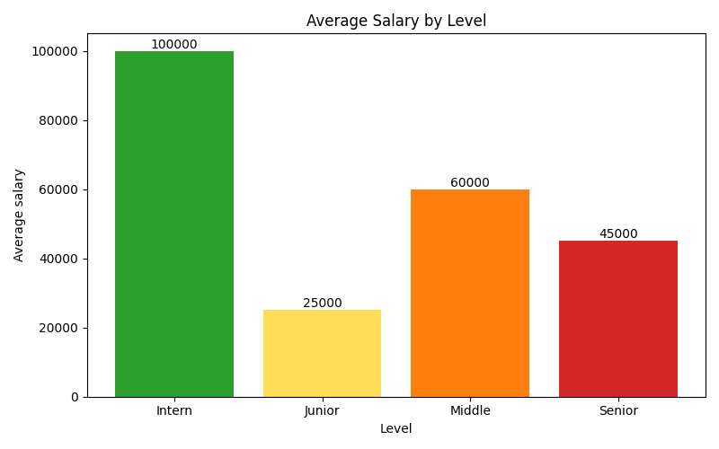
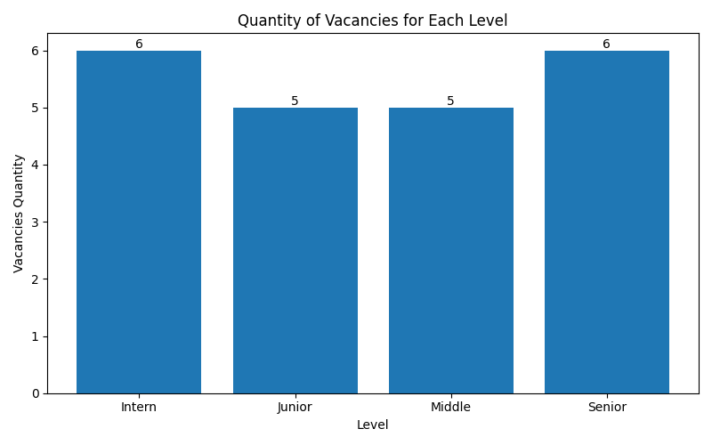
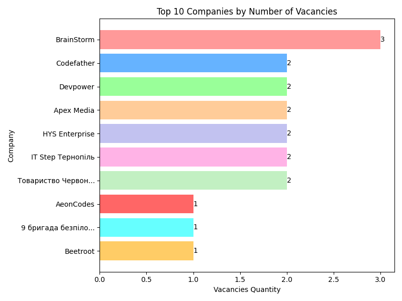

# Python Job Market Analysis

## Description
Analyze most demanded technologies for Python developers using web scraping and data analysis.

## Stack
- requests
- BeautifulSoup
- pandas
- matplotlib

## 📊 Top 20 Technologies

**Insight:**

According to the results of this graph, we can conclude that most of the vacancies  
are for backend Python developers, since we see in the top 10 technologies such as  
Django, REST API, FastAPI, Docker, JavaScript, Flask, Redis and PostgreSQL, which  
are typical for backend developer positions.

## 📊 Vacancies by City

## Average Salary by Level

**Insight:**

Weak correlation observed
Likely caused by:
- mixed Python roles (backend, data analytics, data science, education)
- inconsistent level labeling
- small sample size per level

## Number of Vacancies by Developer Level

**Insight:**

Data is available for only 22 out of 70 vacancies, as most job postings do not specify the level required.  
Nevertheless, it shows that the market roughly requires developers across all levels: from Intern to Senior.

⚠️ Note: The data is incomplete, so the chart and table reflect only the available subset of the market.

## Top 10 companies by number of vacancies

**Insight:**

Most of the companies in Ukraine looking for specialists with Python as a main skill are software development  
companies, which explains the high demand for backend developers.  
Additionally, we can see that one EdTech company is searching for Python teachers, totaling 3 vacancies.  
However, it is difficult to identify the demand for data analytics and data science roles from this top stack,  
because technologies like Pandas, Matplotlib, NumPy, PowerBI, and Tableau do not appear in the top 20.